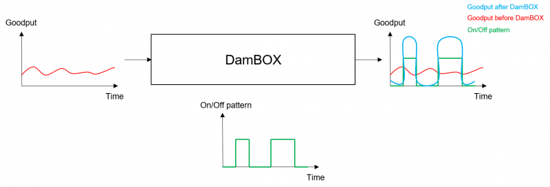
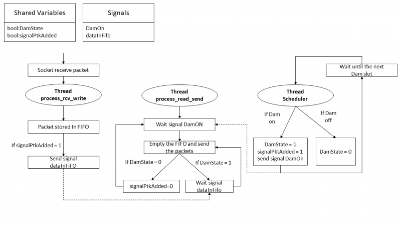
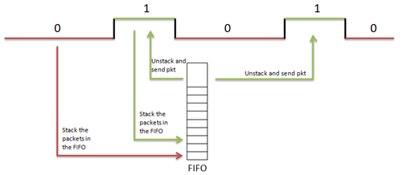
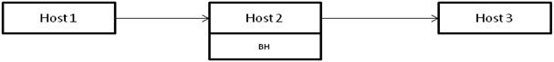
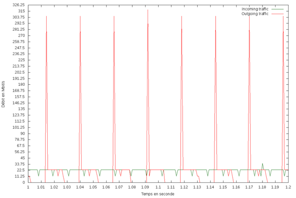
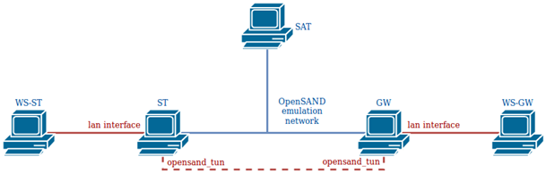
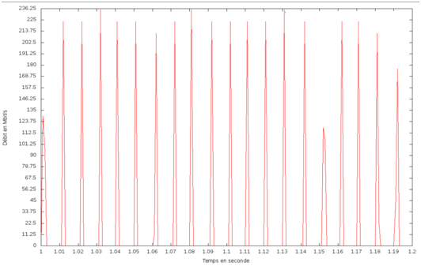
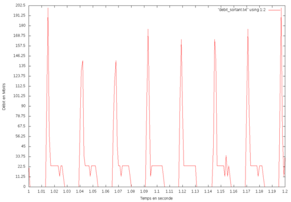
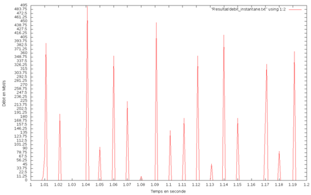

# DamBOX

DamBOX is a software developed in C++ that intermittently releases the packet on the interface, like a dam : using netfilter, incoming packets are intercepted and blocked until released at the interface goodput. The user specifies the duration and frequency of the blocking and releasing function. DamBOX can be used to emulate beam hopping in satellite telecommunication system.

- [Design document](#design-document)
- [Installation](#installation)
  - [Package installation](#package-installation)
  - [Manual installation](#manual-installation)
  - [Generate a debian package](#generate-a-debian-package)
- [Exploitation](#exploitation)
  - [Iptables configuration](#iptables-configuration)
  - [Execution](#execution)
  - [Exploitation with OpenSAND](#exploitation-with-opensand)
  - [Orchestration with OpenBACH](#orchestration-with-openbach)
- [Get Involved](#get-involved)
  - [Partners](#partners)
  - [Licence](#licence)

## Design document

DamBOX is a multilayer filter. It operates at the network level and then at the application level.
- At the network level, DamBOX uses *netfilter* to handle incoming packets which are concerned by the blocking and releasing functions. *netfilter* redirects the relevant packets to a local socket instead of routing them to the output interface.
- At the application level, the binary *dambox* retrieves packets arriving on the socket and adds them to a FIFO queue. It releases the packets on the output interface depending on the timeline.

Deploy to see the detailed design document

The help for setting the executable can be obtained by using the command:

> dambox --help

Shared variables:

- **DamState**: gives the illumination state. If the state is 1, the packets are released; if the state is 0, the packets are stored. This variable can be viewed and modified by several threads, so it is protected by a mutex.
- **signalPktAdded**: boolean that indicates at a given time t whether or not a signal mechanism should be used by the threads process_rcv_write and process_read_send. This variable can be viewed and modified by several threads, so it is protected by a mutex.

The threads:

- **scheduler**: this thread manages the timeline defined by the program's input parameter. If the timeline indicates state 1, it sets the shared variable damState to 1 and sends a signal to process_read_send to inform it that packets can be released. Otherwise, it sets the damState variable to 0. After this step, it waits until the time of the next ds expires.
- **process_rcv_write**: this thread receives the packets from the socket and stores them in a FIFO queue. If the shared variable signalPktAdded is 1, it sends a signal to process_read_send to inform it that a packet has just been added to the FIFO.
- **process_read_send**: this thread waits until receiving a signal informing it that the packets can be released. When the signal is received, it empties the entire FIFO and sends the packets. It then waits to receive a signal informing it that a new packet has been stored, while checking that the packets can still be released. If it does, it sends the packet. Otherwise, it waits for the next signal informing it that the packets can be released.

Vocabulary:

* **DS** (Dam Slot): the smallest unit of time during which a beam can be considered as switched on.
* **TimeLine**: the lighting profile oef the recipient. It is composed of 1 and 0. State 1 corresponds to a beam illuminated by the satellite. During state 0, the receiver is not illuminated. The TimeLine will be repeated indefinitely until the end of the program execution.

## Installation

### Package installation

Deploy to see installation through package

Add the OpenBACH repository :

Update sources.list with net4sat openbach repository
> echo "deb http://packages.net4sat.org/openbach xenial stable" | sudo tee /etc/apt/sources.list.d/dambox.list 

Add Net4Sat repository GPG key
> wget -O - http://packages.net4sat.org/support_net4sat_org_pub.gpg.key |sudo apt-key add -

Update the list of available packages:
>  sudo apt-get update 

Install Dambox
> sudo apt-get install dambox 

### Manual installation

Deploy to see how to manually install

The rest of this README considers a package installation. 
If you want to proceed a manual installation, please replace
> dambox 

by
> ./dambox 

in the provided commands lines. Or simply edit the $PATH variable. 

It is compulsory to install the *netfilter* library on the computer where the DamBOX will be deployed. To do this, simply execute the following command: 

> sudo apt-get install libnetfilter-queue-dev

The maximum size of the FIFO system must be set to a high value. This size is located in the /proc/sys/fs folder and can be set using this command: 

> sudo sysctl fs.pipe-max-size=66781584

The source code of the software can be downloaded through the git repository.

To compile the source code, you must do so with at least C++11 version and including the following libraries for the compilation:

* **lpthread**
* **lnfnetlink**
* **lnetfilter_queue**

On Ubuntu 16.04, here are the requirements :

> sudo apt install make g++ libnetfilter-queue-dev

A makefile is available. Run the following command in the root folder to obtain the binary dambox:

> make

### Generate a debian package

Deploy to see debian package generation

You can generate a debian package (Ubuntu 16.04 only) with the following procedure.
Install the following dependences

> sudo apt-get install build-essential fakeroot devscripts libnetfilter-queue-dev

Then by issuing the following command in the root folder

> dpkg-buildpackage -us -uc

The package will be generated in the root folder

You can install it by running: 

> sudo dpkg -i ../dambox_1.0_amd64.deb

You can remove the unnecessary files as follows:

> rm ../dambox_1.0*

## Exploitation

### Iptables configuration

**Do not ignore this necessary step**

Filtering rules based on *iptables* are necessary to redirect incoming packets to the DamBOX.

> iptables -I FORWARD -j NFQUEUE

Thanks to this *iptables* rules and *netfilter*, the traffic will be redirected to the DamBOX interface.

It may be interesting to add some parameters to the filtering rule :

* **-p** : Filter only such types of protocols (e.g.: UDP)
* **-o** : Filter only packets intended for an interface
* **-i** : Filter only packets arriving from an interface
* **-d** : Filter only packets destined to an IP address 
* **-s** : Filter only packets sent by an IP address

To delete the filter rules, simply execute the following command:

> sudo iptables -F

### Execution

Deploy to see manual DamBOX execution

In order to launch the DamBOX, and only after setting up the [Iptables configuration](#iptables-configuration), the following command can be executed:

> sudo ./dambox -ds $damslot -f $freq (-d $duration --debug) 

The launching of the DamBOX therefore requires at least 2 parameters:

* **damslot** : duration  in us (microsecond) of a timeslot.
* **freq**: Frequency of beam illumination. The beam will be switched on once every freq timeslot (Example: for freq=6, we will have a timeline [100000]).
* If you want to operate the DamBOX for a defined time, you can enter a **duration**. This duration must be entered in second. Otherwise, the executable will run until the user stop the program manually (ctrl+c, ctrl+z, ctrl+\)
* You can also activate the **debug mode** to follow the evolution of the timeline and fifo filling over time

The program exploits these parameters to establish the timeline. Then all the incoming packets are stored on the FIFO. They are only retransmitted to the recipient when the beam is considered switched ON. (See Architecture of DamBOX for more information about the parameters and the design of the program).

At the end of the execution, if the debug mode is activated, the program gives access to two output files:

* **profil_dam.txt** : Evolution of the dam state over time
* **profil_fifo.txt** : Evolution of the FIFO filling over time. The unit is the bytes.

The help for setting the executable can be obtained by using the command:

> ./dambox --help

The program exploits the specified parameters to establish the timeline. Then all the incoming packets are stored on the FIFO. They are only retransmitted to the recipient when the beam is considered switched ON. Architecture of DamBOX provides more information about the parameters and the architecture of the program.

At the end of the execution, if the debug mode is activated, the program gives access to two output files:
- **profil_dam.txt** : Evolution of the blocking/releasing over time
- **profil_fifo.txt** : Evolution of the FIFO filling over time. The unit is the bytes.

#### Validation

This section aims to validate how DamBOX stores and releases packets as expected.

To validate the implementation of DamBOX, the following architecture is exploited. DamBOX is applied on Host 2 and on the interface towards Host 3.

##### Impact on the goodput

For this test, DS is set to 13 ms and freq to 2 (the resulting timeline is [10]). Iperf3 transmit a UDP traffic at 22.5 Mbit/s.

The profile of the incoming and outgoing traffic of DamBOX is shown below:

The rate profile follows the timeline profile. Flow peaks are observed each time the packets are released at the interface goodput.

##### Impact on the delay and jitter

For further validate the implementation, this section assesses how DamBOX modifies the latency and jitter of a communication.

This test was performed without DamBOX, with DamBox and a timeline [1,1] and then with a timeline [1,0]. The DS used is set to 13 ms.

| | Without DamBOX | With DamBOX (timeline) [1,1] |	With DamBOX (timeline) [1,0] |
|-------------|-------------|-------------|-------------|
| Average jitter (ms) |	0.0138 	| 0.0121 |	0.232 |
| Average latency (ms) | 	0.2895 |	0.3145 | 3.5655 |

Using DamBOX without actually storing and releasing packets (e.g. with timeline [1,1]) does not have a considerable impact on the latency and jitter of the communication.

With the timeline [1, 0] and the DS=13ms, we see a latency increase of 3.251ms. With a timeline [1,0], half of the packets will be interrupted by the DamBOX. With a DS of 13ms, packets will wait on average 6.5 ms in the box. The theoretical value (6.5*50%=3.25) corresponds to the experimental value. There is also an increase in the average jitter with the introduction of the beam-hopping in the communication.

### Exploitation with OpenSAND

Deploy to see OpenSAND exploitation

In order to study the impact of the beam-hopping implementation on a satellite communication, it will be necessary to set up the DamBOX on an OpenSAND platform previously deployed. The image below describes the architecture used. 

#### DamBOX deployment

DamBOX is deployed at the gateway.

Packets arriving from WS_GW and destined for WS_ST need to be filtered. The necessary following filtering rule needs to be applied on the GW:

> iptables –I FORWARD –o opensand –j NFQUEUE

dambox binary needs to be run at the GW with the required parameters.

> dambox -ds $ds -f $freq (--debug -d $duration)

#### Impact of DamBOX on end-to-end UDP traffic goodput

The purpose of this section is to see how the DamBOX changes the flow profile, latency and jitter on an OpenSAND platform.

In the case of non-beam-hopped communication (No DamBOX or DamBOX with timeline[1.1]), if a UDP flow at rate 22.5 Mbit/s is transmitted by iperf from WS-GW to WS-ST, the profile rate received by the end user is as follows: 

Flow peaks are observed every 10ms. Indeed, OpenSAND buffers the packets arriving on the GW to retransmit them every 10ms (default value) to the terminal by adding the desired delay.

If DamBOX is set up on GW with parameters BHS=13 ms and freq=2 (timeline [1.0]), the output rate of the GW (GW opensand_tun interface) has the following profile: 

This traffic will then pass through OpenSAND. The flow profile finally received by the ST and the WS-ST end user is as follows: 

#### Impact of DamBOX on end-to-end latency and jitter

It could also be interesting to look how the implementation of DamBOX changes latency and jitter on satellite communication performed by OpenSAND. The OpenBACH jobs iperf, fping, owamp_client/owamp_server can be used to obtain these metrics in the 3 cases tested (without DamBOX, with DamBOX and timeline [1, 1] and finally with DamBOX and timeline [1 ,0]):

| | Without DamBOX 	| With DamBOX timeline [1,1] |	With DamBOX timeline [1,0] |
|-------------|-------------|-------------|-------------| 
| Average jitter (ms) |	0.753 |	0,758 |	0,770 |
| Average latency (ms) |	264.994 |	264.951 |	268.221 |

The integration of DamBOX on OpenSand almost does not change the jitter on the communication. By comparing the latency values for the two cases without intermittency (without DamBOX and with DamBOX and timeline [1, 1]), we identify that the packet passage at the application level does not have a major influence on latency. With the execution of DamBOX with a timeline [1.0], we observe an increase in the average latency of 3.27 ms, which is very close to the theoretically expected value 3.25 ms. 

### Orchestration with OpenBACH

Deploy to see OpenBACH orchestration

OpenBACH provides a job to deploy and run DamBOX on specific agents. 
Please consult OpenBACH source repository to have more information on this feature.

## Get Involved

DamBox is part of OpenBACH project.
OpenBACH is funded and promoted by CNES (French Space Center) as a reference open-source software tool within its research and development studies and activities in the domain of satellite communication systems and networks.

### Partners

Silicom, CNES

### Licence

Copyright © 2020 CNES

OpenBACH is released under GPLv3 (see [COPYING](COPYING.txt) file).

